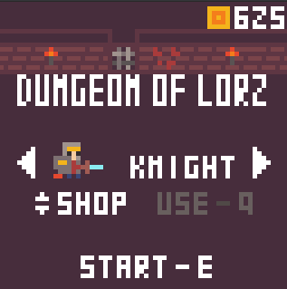
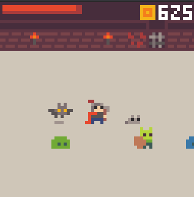
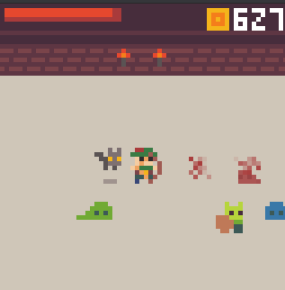
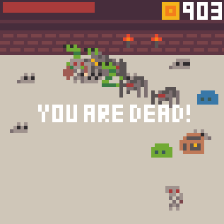

# DUNGEON OF LORZ - LOWREZJAM 2021 Submission
Dungeon of Lorz is a 64x64 hack-n-slash game for [LOWREZJAM 2021](https://itch.io/jam/lowrezjam-2021). Collect coins in the dungeon, unlock upgrades, and delve into the dungeon again!

\* Lorz = low rez :) 

 
 
 
 

Powered by:
- [mugl](https://github.com/andykswong/mugl): Micro WebGL library.
- [munum](https://github.com/andykswong/munum): Micro Numerical library.

Control:
- WASD or arrow keys to move / select upgrades
- E or Enter to attack / start / restart game
- Q to block / buy / equip upgrades

Gamepad Support (only Xbox controller is tested):
- Left stick to move / select upgrades
- A to attack / start / restart game
- B to block / buy / equip upgrades

LOWREZJAM Authenticity:
- To meet the 64x64 resolution requirement of LOWREZJAM 2021, the game is rendered using WebGL with a 64x64 drawing buffer and antialias set to false. The canvas is then upscaled to 256x256 using CSS, with style:  ```image-rendering: crisp-edges; image-rendering: pixelated```;
